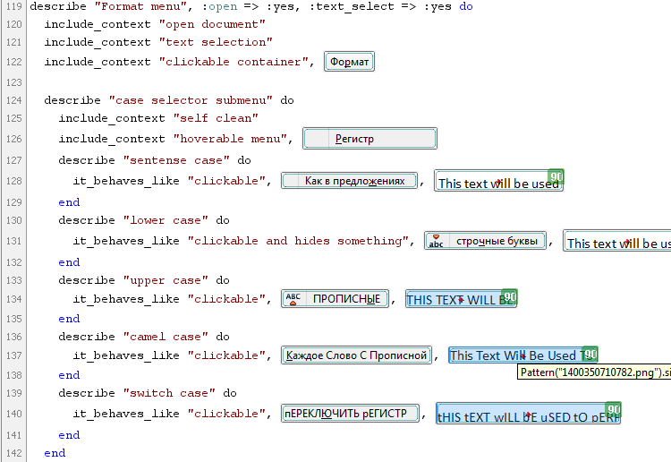
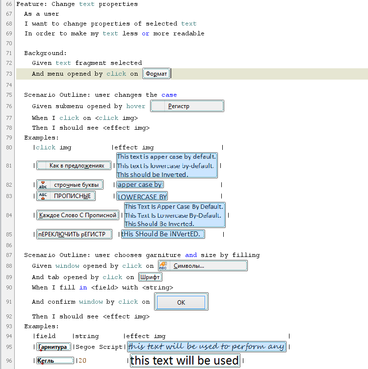

sikulix-ide-templates
=====================

This project is devoted to using of Ruby based DSLs for GUI testing with [SikuliX](https://github.com/RaiMan/SikuliX-2014).

## Using testing frameworks in SikuliX IDE

Previously it was possible to use DSL like Rspec or Cucumber with Sikuli but only in batch mode. The main purpose of this project is a development of use cases for testing frameworks based on Ruby specifically for SikuliX IDE with new Ruby API. DSL support for successful use cases is planed to realize with native IDE support.

You can use our templates for:

* [RSpec](templates/sikulix_rspec.rb) or
* [Cucumber](templates/sikulix_cucumber.rb)

Or look at simple examples of SikuliX project for testing LibreOffice Writer with:

* [RSpec](examples/libreoffice-writer-test/test-rspec.sikuli)

* [Cucumber](examples/libreoffice-writer-test/test-cucumber.sikuli)

SikuliX with an integrated rspec and cucumber gems support is available in [sources](https://github.com/RaiMan/SikuliX-2014) (see also [sikulix.gem](https://github.com/RaiMan/SikuliX-2014/tree/master/JRubyGem)) or [as assembled jars](https://drive.google.com/folderview?id=0Bwx0cbtdU5K6STg2T0l5UWlIRXc&usp=drive_web).

## Using SikuliX without IDE

It is possible to use SikuliX with RSpec, Cucumber or other testing frameworks without IDE. See [comments for sikulix.gem](https://github.com/RaiMan/SikuliX-2014/tree/master/JRubyGem)

sikulix.gem for running SikuliX with an external JRuby now available:

* [rubygem](http://rubygems.org/gems/sikulix)
* [https://launchpad.net/sikuli/](https://launchpad.net/sikuli/)

Notes:

* Don`t forget to set SIKULIXAPI_JAR environment.
* Place images in the same path as the script or use file names with the absolute path or use ImagePath.setBundlePath(PATH) method to specify images path.

**We are welcome to develop any other DSL use cases or it SikuliX IDE native support development.**